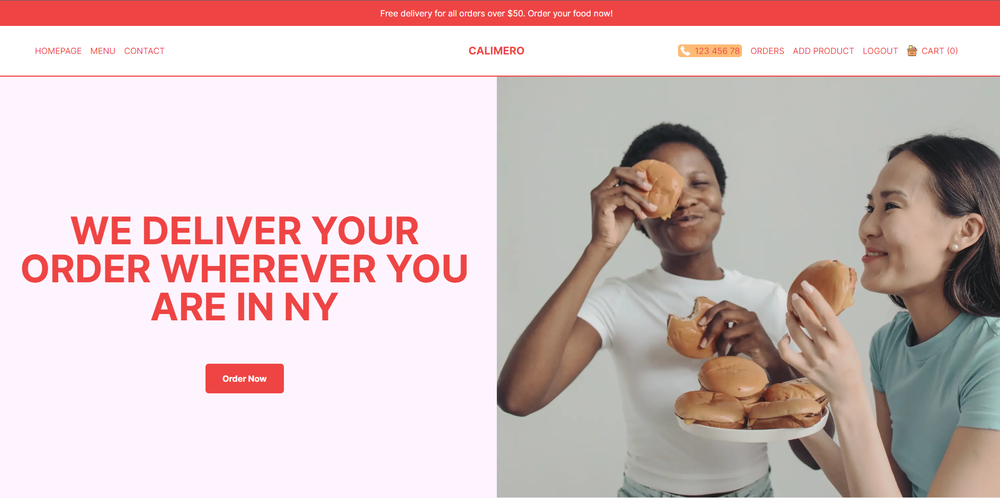
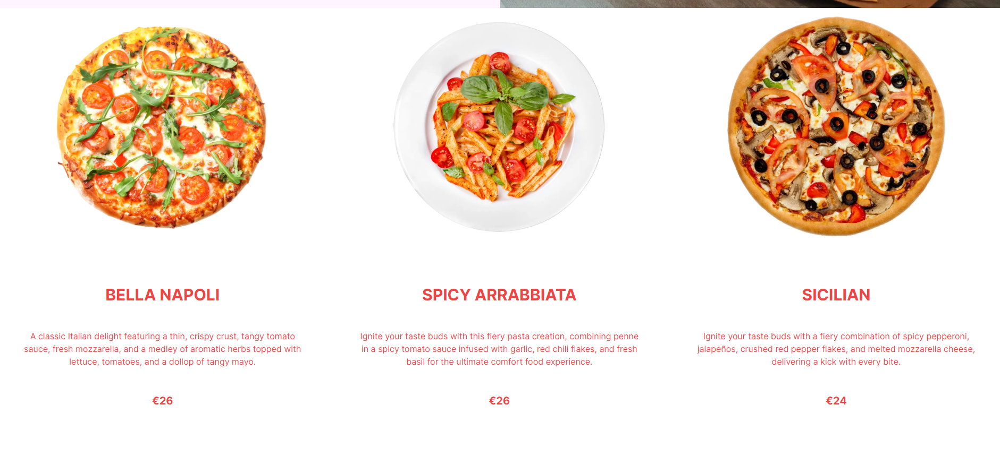
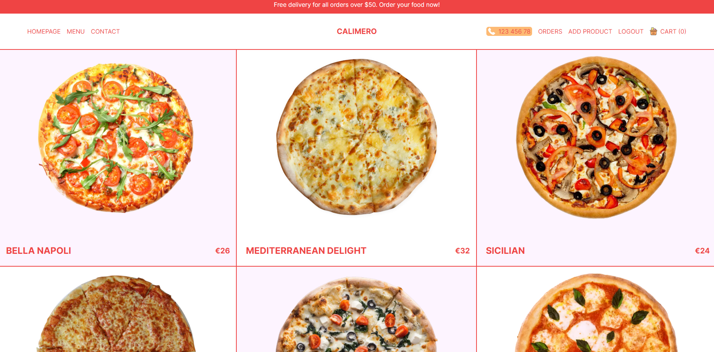
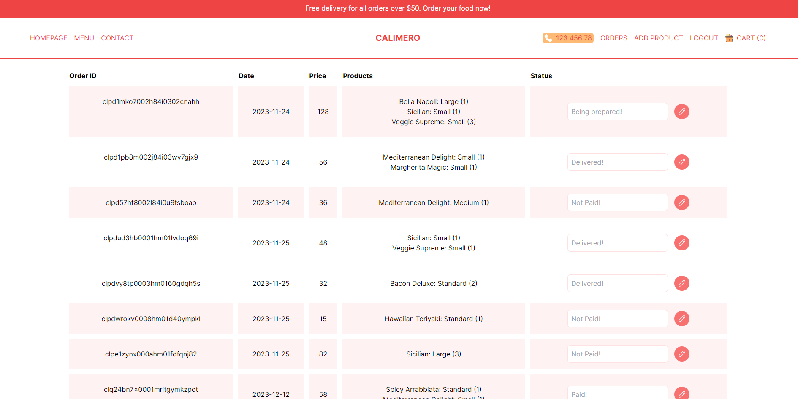
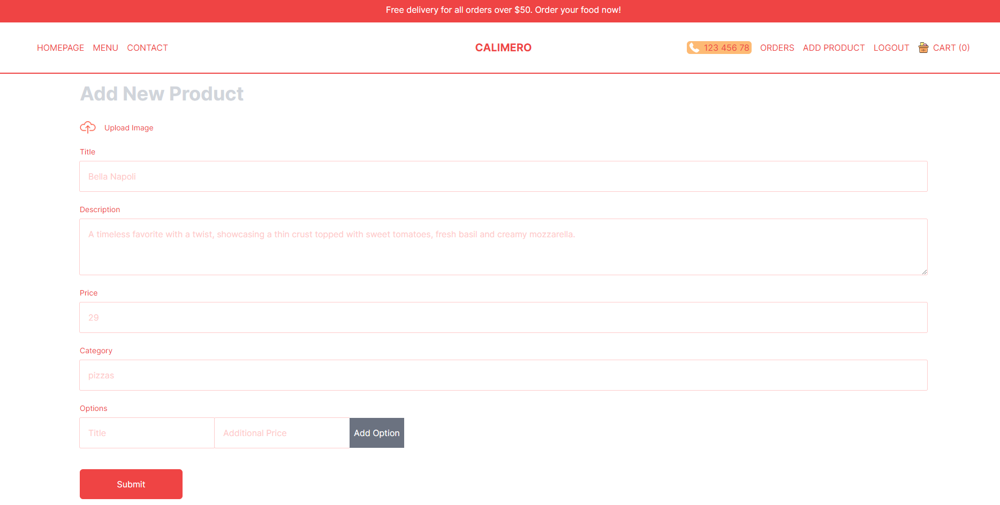
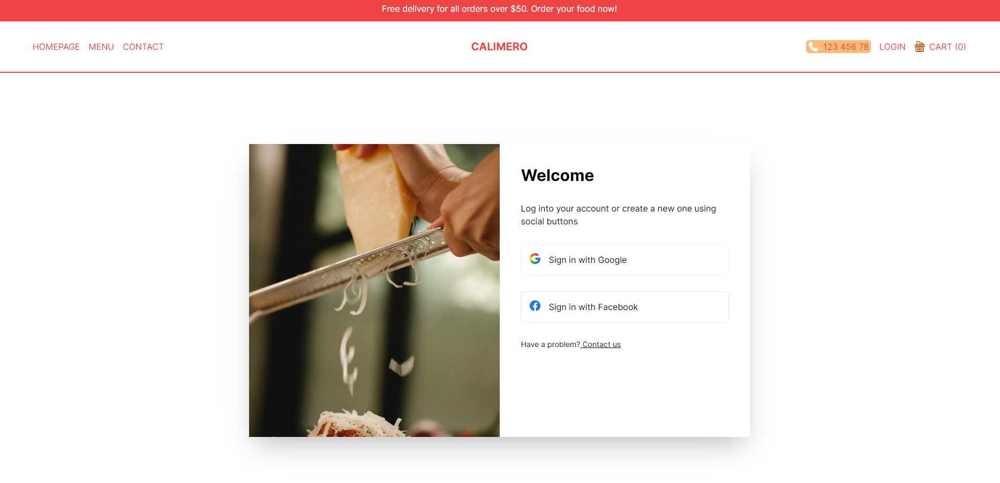

# Calimero Restaurant Application
The Next.js restaurant app is a simple e-commerce application that uses Next.js, React, Tailwind CSS, PostgreSQL, TypeScript and Next Auth. It allows users to browse products, add them to the cart, and checkout using Stripe. The app also has authentication and authorization features using Next Auth and custom hooks.
## Table of contents

## Table of contents

- [Overview](#overview)
- [My Process](#my-process)
- [Features](#features)
- [Screenshot](#screenshot)
- [Links](#links)
- [Author](#author)

## Overview

## My process

This project uses the following technologies:

- [Next.js]: A React framework for building fast and scalable web applications. Also, used for data fetching and routing.
- [Tailwind CSS]: A utility-first CSS framework for rapidly building custom designs.
- [TypeScript]: A superset of JavaScript that adds static types and other features.
- [MongoDB]: A document-based database that stores data in JSON-like format.
- [Auth.js]: A library for implementing authentication and authorization in Next.js apps.
- [Prisma]: An adapter to map the collections of data in MongoDB database
- [React Hook]: A library for building forms with React hooks.
- [React Query]: A library for fetching, caching, and updating data in React apps.

## Features

- Responsive and user-friendly interface
- Product listing and filtering by category
- Shopping cart and checkout functionality
- Payment integration with Stripe
- User authentication and authorization with Google and Facebook
- Admin dashboard to create, delete products, and update the status of each order
- Data fetching and storage with MongoDB
- Type checking with TypeScript
- Styling with Tailwind CSS

## Screenshot

### Slider

### Featured Product

### Menu

### Customer's order / Admin dashboard

### Add Product Page

### Login Page

## Links

- Solution URL: [Solution](https://github.com/Atyn97/calimero-restaurant)
- Live Site URL: [Live site]()

## Author

- Fatin Nooraina - [@Atyn97](https://github.com/Atyn97)

